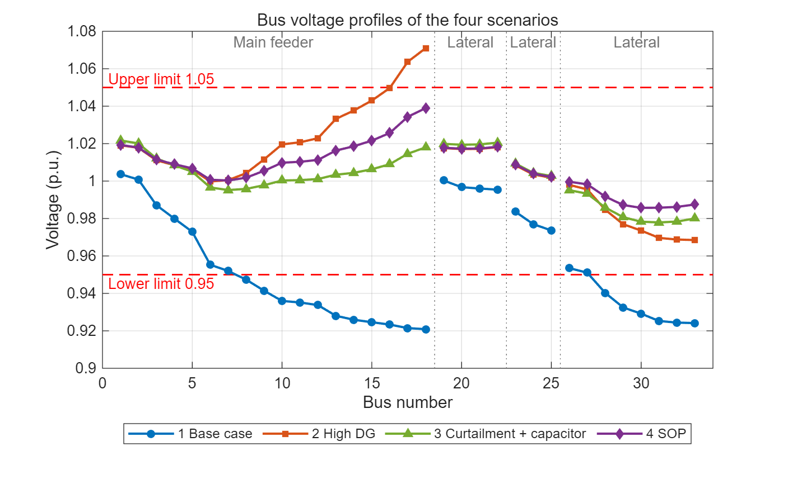

# Voltage Regulation of an IEEE 33-Bus Feeder with High DG Penetration

Steady-state power-flow study in **OpenDSS** of a 12.66 kV distribution feeder with 61 % distributed generation (DG). It shows how a large PV plant at the end of the feeder causes reverse power flow and overvoltage. It then compares two ways to bring every bus back within 0.95–1.05 p.u.:

1. **Conventional local control**: curtail the PV plant and add a shunt capacitor.
2. **Soft open point (SOP)**: move surplus power between two feeder ends with a power-electronic link.


## System

| Item | Value |
|---|---|
| Network | IEEE 33-bus radial feeder: main feeder (buses 1–18) and three laterals |
| Source | 110 kV grid, 50 Hz: 1.05 p.u. behind the default OpenDSS source impedance (2000 MVA short-circuit), so the 110 kV bus sits at 1.048–1.049 p.u. |
| Substation transformer | 110 / 12.66 kV, 5000 kVA, X = 8 %, R = 0.7 % in total (`%R=0.5` sets the 12.66 kV winding; the 110 kV winding keeps the 0.2 % default), no-load loss 0.2 % |
| Load | 32 loads, 3715 kW / 2300 kvar nominal. OpenDSS `Model=1`: constant P and Q between 0.95 and 1.05 p.u., constant impedance outside that band (default `Vminpu`/`Vmaxpu`) |
| DG | PV plant 1450 kW (bus 18), biomass 310 kW (bus 10), mini-hydro 280 kW (bus 22), rooftop PV 240 kW (bus 25) |
| DG penetration | 2280 / 3715 kW = **61.37 %** |

## Scenarios

| # | Script | What changes |
|---|---|---|
| 1 | `01_Base_Case.dss` | No DG |
| 2 | `02_High_DG.dss` | All four DG units at full output |
| 3 | `03_Strategy1_Curtail_Capacitor.dss` | Scenario 2, with the bus-18 PV curtailed to 800 kW / 100 kvar and a 600 kvar capacitor at bus 33 |
| 4 | `04_Strategy2_SOP.dss` | Scenario 2, plus an SOP that draws 500 kW / 200 kvar at bus 18 and injects 490 kW / 150 kvar at bus 33 (2 % converter loss) |

The SOP is modelled as two back-to-back generators, one with negative output at each port.

## Results

Bus voltages are for the 12.66 kV buses 1–33. Losses include the substation transformer. Because loads outside 0.95–1.05 p.u. are modelled as constant impedance, the loads actually draw 3643 kW in scenario 1 and 3720 kW in scenario 2, rather than the nominal 3715 kW.

| Scenario | Grid import (kW) | Total losses (kW) | Min voltage (p.u.) | Max voltage (p.u.) | Buses outside 0.95–1.05 p.u. |
|---|---:|---:|---|---|---|
| 1 Base case | 3868 | 225.0 | 0.921 (bus 18) | 1.004 (bus 1) | 17 below 0.95 (buses 8–18, 28–33) |
| 2 High DG | 1585 | 144.9 | 0.969 (bus 33) | **1.071 (bus 18)** | 2 above 1.05 (buses 17, 18) |
| 3 Curtailment + capacitor | 2177 | 92.4 | 0.978 (bus 31) | 1.022 (bus 1) | none |
| 4 SOP | 1529 | 84.1 | 0.986 (bus 30) | 1.039 (bus 18) | none |

### Findings

- **Base case:** with one-way power flow, voltage falls along the long branches, and 17 of 33 buses drop below 0.95 p.u.
- **High DG:** DG at 61 % penetration removes every undervoltage and cuts losses by about a third. But the 1450 kW PV plant at bus 18 far exceeds local load. Its surplus flows back up the main feeder and pushes buses 17–18 above the 1.05 p.u. limit.
- **Strategy 1 (curtailment + capacitor):** brings every bus within limits, at the cost of curtailing 650 kW (45 %) of the bus-18 PV output.
- **Strategy 2 (SOP):** also brings every bus within limits, with no curtailment. Network losses are 84 kW, or about 94 kW once the SOP's own 10 kW converter loss is counted. That is close to Strategy 1, so the SOP's main gain is using all the renewable output, in exchange for more expensive power-electronic equipment.

### Voltage profiles



Each scenario also has its own voltage profile, branch power-flow plot and line-loss plot in [`figures/`](figures):

| Scenario | Voltage | Power flow | Line losses |
|---|---|---|---|
| 1 Base case | [plot](figures/1_base_voltage.png) | [plot](figures/1_base_power_flow.png) | [plot](figures/1_base_line_losses.png) |
| 2 High DG | [plot](figures/2_high_dg_voltage.png) | [plot](figures/2_high_dg_power_flow.png) | [plot](figures/2_high_dg_line_losses.png) |
| 3 Curtailment + capacitor | [plot](figures/3_strategy1_voltage.png) | [plot](figures/3_strategy1_power_flow.png) | [plot](figures/3_strategy1_line_losses.png) |
| 4 SOP | [plot](figures/4_sop_voltage.png) | [plot](figures/4_sop_power_flow.png) | [plot](figures/4_sop_line_losses.png) |

Line *k* feeds bus *k* + 1, so line 17 is the last section of the main feeder (bus 17 to bus 18).

## Repository layout

```
opendss/
  IEEE33_Network.dss      shared network: source, transformer, 32 lines, 32 loads
  BusCoords.dss           bus coordinates for OpenDSS plots
  DG_Units.dss            the four DG units
  01_Base_Case.dss ... 04_Strategy2_SOP.dss   one script per scenario
results/                  OpenDSS CSV exports (voltages, losses, branch powers) for each scenario
matlab/
  plot_results.m          reads results/ and draws every plot in figures/
figures/                  voltage profiles, branch power flows and line losses
```

## How to run

1. Install [OpenDSS](https://sourceforge.net/projects/electricdss/) (free, Windows).
2. Open one of the scenario scripts in `opendss/` and run the whole file.
3. The script solves the power flow, writes three CSV files next to itself, and opens the voltage profile, circuit power plot and loss report.
4. To redraw the figures, open `matlab/plot_results.m` in MATLAB and press Run. It reads the CSV files in `results/`, saves every plot to `figures/`, and prints each scenario's losses, grid import, voltage range and number of buses outside the limits.

The copies in `results/` come from the run used for the tables above. To plot a new OpenDSS run, first copy the three `S*_*.csv` files it wrote in `opendss/` into `results/`.